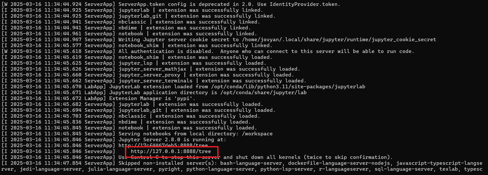
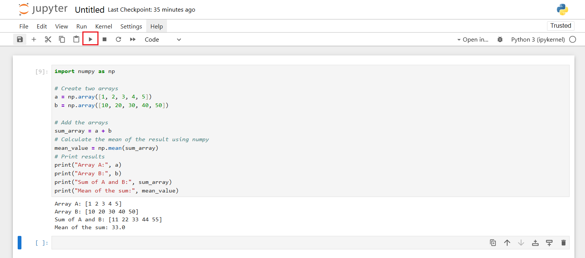

# Docker Image with pytroch_cuda
This docker image contains these Python Packets + Jupyter Notebook: 
- num
- numba
- pandas
- scikit-learn
- matplotlib
- pytorch + CUDA 
- Huggingface Transformer
- accelerate

## Getting Started

These instructions will guide you on how to use this Docker image to run a container with Jupyter Notebook and GPU support.

### Prerequisities

Please make sure that you have nvidia gpu on your computer.

You can verify it by running the following command in your terminal: 
```shell
nvidia-smi
```
If you see a GPU summary like this, you're good to go: 
 

In order to run this container you'll need docker installed: 

* [Windows](https://docs.docker.com/desktop/setup/install/windows-install/)
* [OS X](https://docs.docker.com/desktop/setup/install/mac-install/)
* [Linux](https://docs.docker.com/desktop/setup/install/linux/)
  
If you need help with installation, these YouTube tutorials may help:

* [Windows](https://www.youtube.com/watch?v=-EXlfSsP49A)
* [OS X](https://www.youtube.com/watch?v=-EXlfSsP49A)
* [Linux Ubuntu](https://www.youtube.com/watch?v=cqbh-RneBlk)
### Usage
### Make sure your docker is running before proceeding: 

Ensure Docker Desktop is running before proceeding:
 

#### First Step : Pull the image 

```shell
docker pull maalejnour/pytorch_cuda:latest
```
Wait until the pull is complete: 

 

After pulling the image, You should see maalejnour/pytorch_cuda:latest in the list:

```shell
docker images
```
 

#### Second Step : Run the docker container 

To start a container with Jupyter Notebook, use:
```shell
docker run -it -p 8888:8888 --gpus all maalejnour/pytorch_cuda:latest
```
You'll see an output like this with a Jupyter Notebook URL:

 

#### Third Step : Open Jupyter-Notebook

Copy and paste the provided link into your web browser:

 


Once opened: 


* Click New Notebook: 


* Select the PyKernel to start coding: 


## You can now start coding !

### Example: 

Run the Python code by clicking on the Red Squared Button

 
